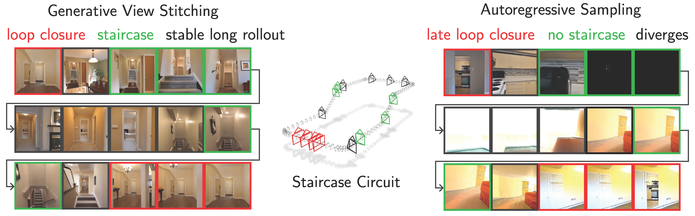

<h1 align="center">Generative View Stitching</h1>
<p align="center">
  <p align="center">
    <a href="https://andrewsonga.github.io/">Chonghyuk (ND) Song</a><sup>1</sup>
    ·
    <a href="https://michal-stary.github.io/">Michal Stary</a><sup>1</sup>
    ·
    <a href="https://boyuan.space/">Boyuan Chen</a><sup>1</sup>
    ·
    <a href="https://grgkopanas.github.io/">George Kopanas</a><sup>2</sup>
    ·
    <a href="https://vincentsitzmann.com/">Vincent Sitzmann</a><sup>1</sup>
    <br/>
    <sup>1</sup>MIT CSAIL, Scene Representation Group <sup>2</sup>Runway ML
  </p>
  <h3 align="center"><a href="https://arxiv.org/abs/2510.24718">Paper</a> | <a href="https://andrewsonga.github.io/gvs/">Website</a></h3>
</p>

This is the official repository for the paper [**_Generative View Stitching_**](https://arxiv.org/abs/2510.24718) (GVS), which enables <i>collision-free</i> camera-guided video generation for <i>predefined</i> trajectories, and presents a <i>non-autoregressive</i> alternative to video length extrapolation.



## Previous Bugs

Before a recent [commit](https://github.com/andrewsonga/generative_view_stitching/commit/fcac2f4ef99d42b1a03499741f96310588e2f0cf) there was a bug in the code that overestimated the MET3R cosine value. **Please pull the latest version of the codebase to replicate the quantitative results in the paper**.

## 🚀 Quick Start

### Setup

#### 1. Clone repository and all submodules
```
git clone git@github.com:andrewsonga/generative_view_stitching.git --recursive
cd generative_view_stitching
```

#### 2. Build conda environment via one of two ways:
a) Create a conda environment based on an environment definition file. This option ensures maximum reproducibility by encoding both conda and pip dependencies but is overfit to our source machine's platform settings (Ubuntu 22.04.5, NVIDIA Driver Version 545.23.08, CUDA Version 12.3).
```bash
conda env create -f environment.yml
conda activate gvs
```

b) Create a new conda environment and install dependencies with pip. This option better adapts to the user's machine by encoding only pip dependencies but may be less reproducible.
```bash
conda create python=3.10 -n gvs
conda activate gvs
pip install -r requirements.txt
```

#### 3. Install submodules:
```
# met3r
cd third_party/met3r
pip install -r requirements.txt      # this will automatically install featup and pytorch3d 
pip install -e .                     # this will actually install met3r
cd ../../

# VideoDepthAnything
cd third_party/Video-Depth-Anything
sh get_weights.sh                    # this will download checkpoints
cd ../../
```

#### 4. Connect to Weights & Biases:
We use Weights & Biases for logging. [Sign up](https://wandb.ai/login?signup=true) if you don't have an account, and *modify `wandb.entity` in `config.yaml` to your user/organization name*.

#### 5. Download Benchmark
Download and uncompress our benchmark camera trajectories with the following command (takes ~3 minutes):
```
sh get_benchmark.sh
```

### Generating Stitched Videos with Pretrained DFoT Models

#### 1. GVS on **Staircase Circuit** (120 frames, takes ~5 minutes per sample on a single NVIDIA H200 GPU)
> **NOTE**: if you encounter CUDA out-of-memory errors (due to limited VRAM), try running with `@baseline/ours_scalable` and `algorithm=gvs_scalable_video_pose`, which requires less VRAM by denoising every context window one-by-one.
```
python main.py @baseline/ours algorithm=gvs_video_pose dataset=staircase_circuit @experiment/main_ours_staircase_circuit
```

#### 2. GVS on the **Impossible Staircase** (120 frames, takes ~5 minutes per sample on a single NVIDIA H200 GPU)
```
python main.py @baseline/ours algorithm=gvs_video_pose dataset=impossible_staircase @experiment/application_impossible_staircase
```

#### 3. Generating videos on other benchmarks and with other sampling methods:
We provide the [commands](configurations/shortcut/experiment/README.md) for reproducing every experiment in our paper.

## 📝 Acknowledgements
This repo is forked from [History-Guided Video Diffusion](https://github.com/kwsong0113/diffusion-forcing-transformer), which in turn is forked from [Boyuan Chen](https://boyuan.space/)'s research template [repo](https://github.com/buoyancy99/research-template). By its license, you must keep the above sentence in `README.md` and the `LICENSE` file to credit the author.

This work was supported by the National Science Foundation under Grant No. 2211259, by the Singapore DSTA under DST00OECI20300823 (New Representations for Vision, 3D Self-Supervised Learning for Label-Efficient Vision), by the Intelligence Advanced Research Projects Activity (IARPA) via Department of Interior/Interior Business Center (DOI/IBC) under 140D0423C0075, by the Amazon Science Hub, by the MIT-Google Program for Computing Innovation, by Sony Interactive Entertainment, and by a 2025 MIT ORCD Seed Fund Compute Grant.

## 📌 Citation

If our work is useful for your research, please consider giving us a star and citing our paper:

```bibtex
@article{song2025gvs,
  title={Generative View Stitching}, 
  author={Song, Chonghyuk and Stary, Michal and Chen, Boyuan and Kopanas, George and Sitzmann, Vincent},
  journal={arXiv preprint arXiv:2510.24718},
  year={2025},
}
```
